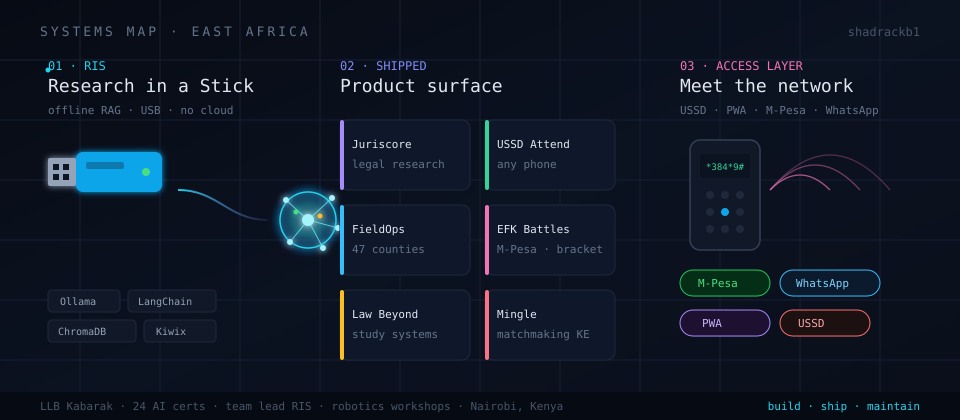
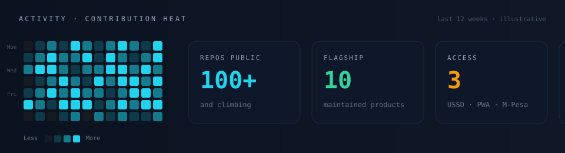
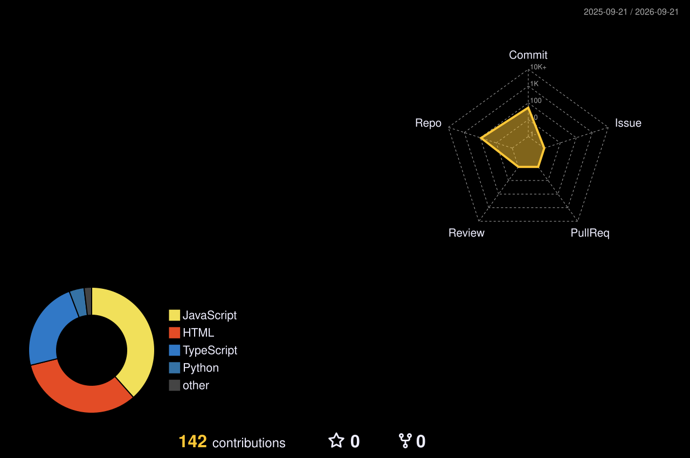
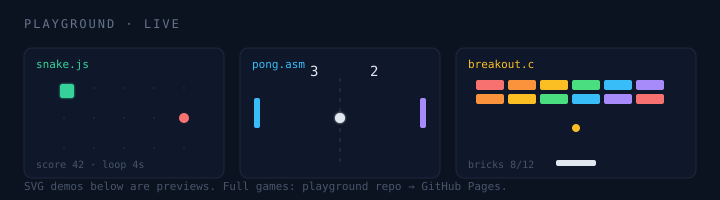

<!-- capsule brand bar -->

**Engineer · LLB, Kabarak University · Nairobi**

Offline AI. Legal tech. Field systems. Campus infrastructure. Products that survive real networks.

 

<!-- skill icons -->

 

<!-- trophies -->

<!-- visitor counter -->

  

---

## Navigation

[About](#about) · [Impact](#impact) · [Stack](#stack) · [Credentials](#credentials) · [Pipeline](#pipeline) · [Activity](#activity) · [Work](#work) · [Playground](#playground) · [Recent](#recent-activity) · [Contact](#contact)

---

## About

I lead **Research in a Stick (RIS)**: an offline AI research workstation that boots from a USB drive. Local LLMs, document RAG, citation engine, Kiswahili and English. No cloud account. No install.

I organize robotics and applied AI workshops at Kabarak University. I study law. The numbers below come from shipped work, not pitch decks.

---

## Impact

---

## Stack

---

## Credentials

---

## Pipeline

How RIS moves a document to a cited answer without leaving the stick.

---

## Activity

---

## Work

### Research in a Stick

USB offline RAG. Ollama, LangChain, ChromaDB, Kiwix, citation engine. CRIW 2026.

### Flagship products

| Product | Domain |
| --- | --- |
| [Juriscore](https://github.com/shadrackb1/juriscore) | Legal research |
| [Know Your Rights](https://github.com/shadrackb1/know-your-rights) | Legal literacy |
| [Law Beyond](https://github.com/shadrackb1/law-beyond) | Study systems |
| [USSD Attendance](https://github.com/shadrackb1/ussd-attendance) | Feature-phone check-in |
| [KSAS](https://github.com/shadrackb1/KSAS) | Campus attendance security |
| [Foursons FieldOps](https://github.com/shadrackb1/foursons-fieldops) | Field operations |
| [EFK Battles](https://github.com/shadrackb1/efk-battles) | Tournaments + M-Pesa |
| [Mingle](https://github.com/shadrackb1/mingle-app) | Matchmaking |
| [CareConnect](https://github.com/shadrackb1/careconnect1) | Care coordination |
| [OBOMOCARE](https://github.com/shadrackb1/obomocare-live) | Community platform |

### More in the repo list

Housing, retail, insurance, hospitality, justice orgs, foundations, school analytics, fashion, restaurants.

---

## Playground

| Demo | Play |
| --- | --- |
| Snake | [play](https://shadrackb1.github.io/playground/snake.html) |
| Pong | [play](https://shadrackb1.github.io/playground/pong.html) |
| Memory | [play](https://shadrackb1.github.io/playground/memory.html) |
| Reaction | [play](https://shadrackb1.github.io/playground/reaction.html) |
| **USSD simulator** | [play](https://shadrackb1.github.io/playground/ussd.html) |
| **RIS lab** | [play](https://shadrackb1.github.io/playground/ris-lab.html) |

Hub: [shadrackb1.github.io/playground](https://shadrackb1.github.io/playground/)

---

## Recent activity

<!-- ACTIVITY:START -->
<!-- ACTIVITY:END -->

---

## Contact

[shadrackb@kabarak.ac.ke](mailto:shadrackb@kabarak.ac.ke) · [LinkedIn](https://www.linkedin.com/in/shadrackbaraka)

