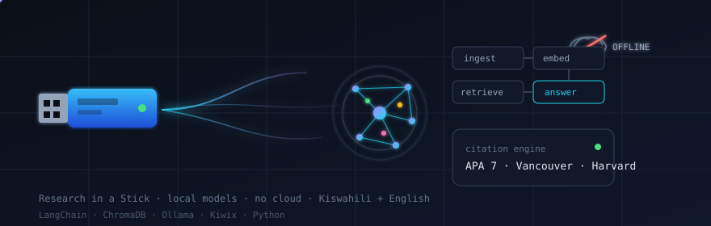

# Shadrack Baraka Mwahanga

Law student at Kabarak University. I build offline AI systems for people the internet still misses.

---

## Research in a Stick (RIS)

Team leader. A USB-based offline research workstation for students and researchers without reliable internet.

- Offline chat in English and Kiswahili (Ollama + Llama 3.2 3B / Qwen 2.5 3B)
- RAG over uploaded documents (LangChain + ChromaDB + all-MiniLM-L6-v2)
- Offline knowledge library (Kiwix ZIM)
- Citation engine: APA 7, Vancouver, Harvard
- CSV analysis and summary stats
- No cloud, no install, no account

Built for Central Rift Valley Innovation Week 2026 at Kabarak University. Target reach: 4.5M university students, 500K rural researchers, 3M secondary students. Unit price KES 2,500 to 6,000.

---

## Selected projects

| Project | What it does |
| --- | --- |
| [Juriscore](https://github.com/shadrackb1/juriscore) | Legal research for Kenyan law students |
| [Know Your Rights](https://github.com/shadrackb1/know-your-rights) | Plain-language legal rights guidance |
| [Law Beyond](https://github.com/shadrackb1/law-beyond) | Study planner, streaks, budgets |
| [KSAS](https://github.com/shadrackb1/KSAS) | Campus attendance with short-lived QR and device binding |
| [USSD Attendance](https://github.com/shadrackb1/ussd-attendance) | Check-in on any phone, no app required |
| [EFK Battles](https://github.com/shadrackb1/efk-battles) | eFootball tournaments with M-Pesa entry |
| [Mingle](https://github.com/shadrackb1/mingle-app) | Matchmaking for the Kenyan market |
| [Foursons FieldOps](https://github.com/shadrackb1/foursons-fieldops) | Field operations across 47 counties |
| [CareConnect](https://github.com/shadrackb1/careconnect1) | Real-time care coordination |
| [OBOMOCARE](https://github.com/shadrackb1/obomocare-live) | Community organization platform |

---

## Credentials

- Bachelor of Laws (LLB), Kabarak University
- 24 AI certifications. 15 from Anthropic Claude Academy. Others from Microsoft Learn, University of Helsinki (Elements of AI), and Kaggle
- Robotics event organizer at Kabarak: workshops on hardware and applied AI
- Team leader, Research in a Stick

[Verify Claude Academy certs](https://academy.claude.com) · [Microsoft Learn](https://learn.microsoft.com/en-us/users/shadrackbarakamwahanga-4798) · [Kaggle](https://kaggle.com/shadrackbarakamwahanga)

---

## Interests

Offline AI for East Africa. Data sovereignty. AI ethics and governance. Legal technology. Mooting and advocacy.

---

## Contact

shadrackb@kabarak.ac.ke · [LinkedIn](https://www.linkedin.com/in/shadrackbaraka)
