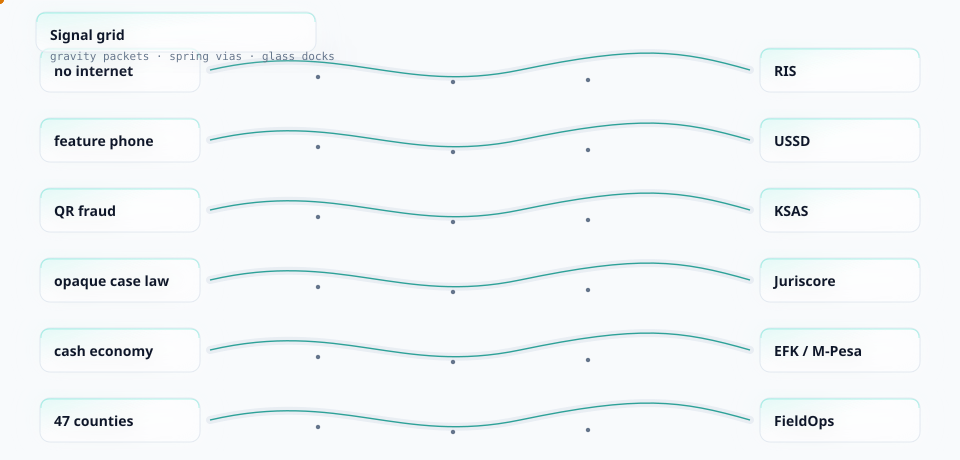
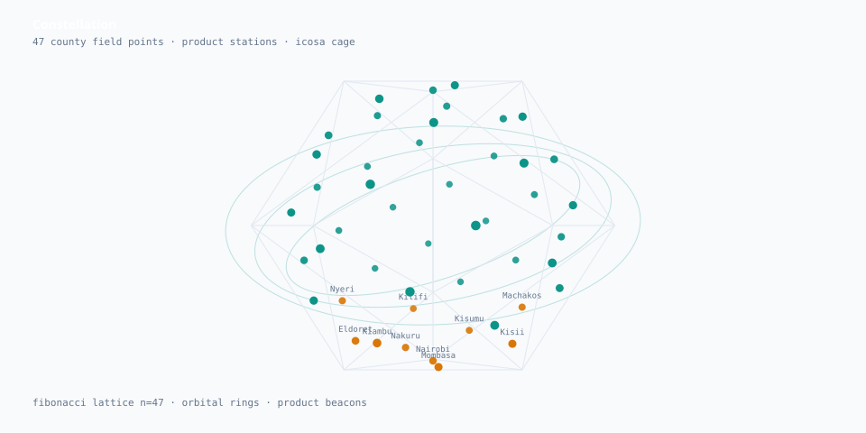

<picture>
  <source media="(prefers-color-scheme: dark)" srcset="./hero-attractor-dark.svg">
  
</picture>

### Engineer · LLB Kabarak · systems for Kenyan constraints

I build software for conditions most stacks ignore: no reliable internet, feature phones, screenshot fraud, cash rails, and crews spread across 47 counties. Constraint first; framework last.

 

<picture>
  <source media="(prefers-color-scheme: dark)" srcset="./signal-grid-dark.svg">
  
</picture>

---

## Flagship systems

<picture>
  <source media="(prefers-color-scheme: dark)" srcset="./constellation-dark.svg">
  
</picture>

| System | What it does | Hard constraint it answers |
| --- | --- | --- |
| [Research in a Stick](https://github.com/shadrackb1/research-in-a-stick) | Offline AI research workstation on USB | Labs and libraries without network |
| [KSAS](https://github.com/shadrackb1/KSAS) | Expiring QR + device-bound check-in | Lecture-hall screenshot fraud |
| [Juriscore](https://github.com/shadrackb1/juriscore) | Case search, briefs, citations for Kenyan law students | PDF directories that do not teach |
| [USSD Attendance](https://github.com/shadrackb1/ussd-attendance) | Dial-in attendance, any handset | Smartphones and data are not default |
| [Foursons FieldOps](https://github.com/shadrackb1/foursons-fieldops) | Sites, fuel, breakdowns, casual registry | One crew, 47 counties |
| [EFK Battles](https://github.com/shadrackb1/efk-battles) | Tournaments, M-Pesa entry, brackets | Cash economy payments end to end |

---

## Selected work

| Domain | Repos |
| --- | --- |
| Legal literacy | [Know Your Rights KE](https://github.com/shadrackb1/knowyourrightske) · [Law Beyond](https://github.com/shadrackb1/law-beyond) · [Haki](https://github.com/shadrackb1/haki-chatbot) |
| Campus | [KABU AI](https://github.com/shadrackb1/KABU-AI) · [Class Connect](https://github.com/shadrackb1/class-connect) · [CampusEats](https://github.com/shadrackb1/Campuseats) |
| Markets & money | [ShopLedger](https://github.com/shadrackb1/shopledger) · [STK Push sandbox](https://github.com/shadrackb1/Stk-push) · [Jua Kazi KE](https://github.com/shadrackb1/JUA-KAZI-KE) |
| Community | [OBOMOCARE](https://github.com/shadrackb1/obomocare-live) · [CareConnect](https://github.com/shadrackb1/careconnect1) · [PAWA](https://github.com/shadrackb1/PAWA) |
| Client builds | Housing, insurance, hospitality, fashion, real estate across the repo list |

---

## How the work gets made

Stack shifts with the constraint: React/Next when there is a browser and bandwidth, Node/Express/Postgres for USSD and money paths, FastAPI for research corpora, Firebase when realtime ops matter more than elegance. Delivery is usually a thin client, a boring API, and an offline or low-band path.

Credentials and verification links live in the [playground credentials hub](https://shadrackb1.github.io/playground/credentials.html). Portfolio: [shadrack-portfolio-alpha.vercel.app](https://shadrack-portfolio-alpha.vercel.app).

<picture>
  <source media="(prefers-color-scheme: dark)" srcset="./glyph-dark.svg">
  
</picture>

---

## Demos

Games and product mocks, each file a complete app with no build step:

[Snake](https://shadrackb1.github.io/playground/snake.html) · [Pong](https://shadrackb1.github.io/playground/pong.html) · [2048](https://shadrackb1.github.io/playground/game-2048.html) · [USSD simulator](https://shadrackb1.github.io/playground/ussd.html) · [RIS lab](https://shadrackb1.github.io/playground/ris-lab.html) · [hub](https://shadrackb1.github.io/playground/)

---

## Contact

[shadrackb@kabarak.ac.ke](mailto:shadrackb@kabarak.ac.ke) · [LinkedIn](https://www.linkedin.com/in/shadrackbaraka) · [Portfolio](https://shadrack-portfolio-alpha.vercel.app)

Hero: Thomas attractor, 2400 Euler integrations, icosahedral product cage. Grid: 18 packet agents on PCB buses. Constellation: Fibonacci lattice n=47. Glyph: dual superformula. Generated, not drawn.
