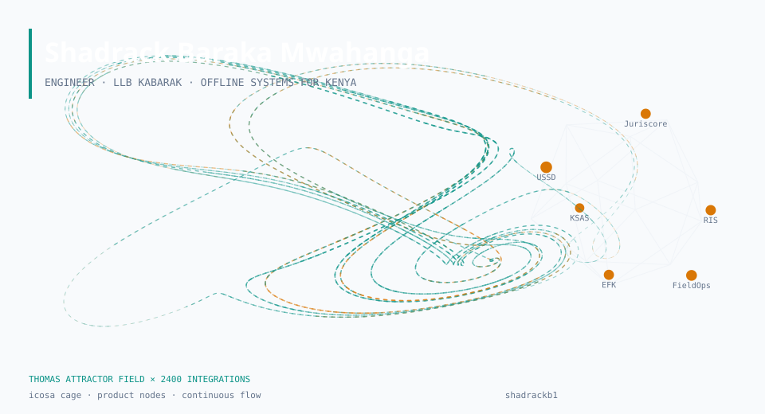
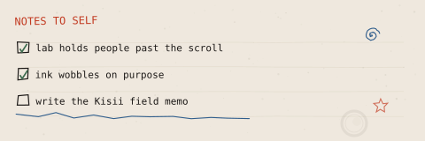
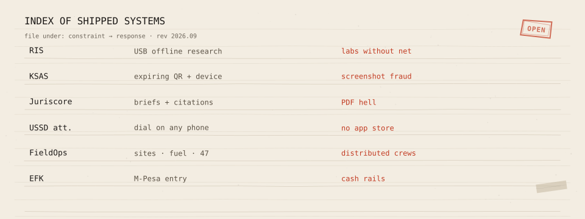

<picture>
  <source media="(prefers-color-scheme: dark)" srcset="./hero-attractor-dark.svg">
  
</picture>

**Shadrack Baraka Mwahanga** · engineer · LLB Kabarak · Nakuru / Nairobi

**Constraint is the brief.** I ship systems for the Kenya most stacks ignore: no reliable internet, feature phones, screenshot fraud, M-Pesa cash rails, crews in 47 counties. Law school taught me to read the rule; field ops taught me to build the one that survives.

---

## Stay in the lab

**[Open Shadrack Lab](https://shadrackb1.github.io/playground/lab.html)** — six interactive systems. Cursor drives everything. Nothing loops. You will lose time.

| Biome | Control |
| --- | --- |
| Flow field | Drag to pour a vortex through curl-noise rivers |
| Particle life | Hold to gravity-well four emergent species |
| Attractor | Hold for Lorenz, release for Thomas; mouse bends ρ |
| Chladni | Sand finds nodal lines; mouse tunes modes `m, n` |
| Julia | Complex `c` rides the cursor; hold to dive in |
| Soft bodies | Herd soft blobs |

Keys `1`–`6` switch. Idle mode keeps the field breathing. [Playground hub](https://shadrackb1.github.io/playground/) also has games and product mocks.

<picture>
  <source media="(prefers-color-scheme: dark)" srcset="./sketch-coverage-dark.svg">
  
</picture>

<picture>
  <source media="(prefers-color-scheme: dark)" srcset="./margin-notes-dark.svg">
  
</picture>

---

## Flagship systems

<picture>
  <source media="(prefers-color-scheme: dark)" srcset="./case-index-dark.svg">
  
</picture>

| System | What it does | Hard constraint |
| --- | --- | --- |
| [Research in a Stick](https://github.com/shadrackb1/research-in-a-stick) | Offline AI research on USB | Labs without network |
| [KSAS](https://github.com/shadrackb1/KSAS) | Expiring QR + device bind | Screenshot fraud |
| [Juriscore](https://github.com/shadrackb1/juriscore) | Case search, briefs, citations | PDF directories that do not teach |
| [USSD Attendance](https://github.com/shadrackb1/ussd-attendance) | Dial-in on any handset | No app store required |
| [Foursons FieldOps](https://github.com/shadrackb1/foursons-fieldops) | Sites, fuel, breakdowns | One crew, 47 counties |
| [EFK Battles](https://github.com/shadrackb1/efk-battles) | Tournaments, M-Pesa entry | Cash economy end to end |

---

## Selected work

| Domain | Repos |
| --- | --- |
| Legal literacy | [Know Your Rights KE](https://github.com/shadrackb1/knowyourrightske) · [Law Beyond](https://github.com/shadrackb1/law-beyond) · [Haki](https://github.com/shadrackb1/haki-chatbot) |
| Campus | [KABU AI](https://github.com/shadrackb1/KABU-AI) · [Class Connect](https://github.com/shadrackb1/class-connect) · [CampusEats](https://github.com/shadrackb1/Campuseats) |
| Markets & money | [ShopLedger](https://github.com/shadrackb1/shopledger) · [STK sandbox](https://github.com/shadrackb1/Stk-push) · [Jua Kazi KE](https://github.com/shadrackb1/JUA-KAZI-KE) |
| Community | [OBOMOCARE](https://github.com/shadrackb1/obomocare-live) · [CareConnect](https://github.com/shadrackb1/careconnect1) · [PAWA](https://github.com/shadrackb1/PAWA) |

---

## Method

Stack follows the constraint, not the résumé. React or Next when bandwidth exists. Node, Express, Postgres on USSD and money paths. FastAPI for research corpora. Firebase when realtime ops matter more than elegance. Ship a thin client, a boring API, and an offline path.

Credentials: [hub](https://shadrackb1.github.io/playground/credentials.html). Portfolio: [shadrack-portfolio-alpha.vercel.app](https://shadrack-portfolio-alpha.vercel.app).

<picture>
  <source media="(prefers-color-scheme: dark)" srcset="./glyph-dark.svg">
  
</picture>

---

## Contact

[shadrackb@kabarak.ac.ke](mailto:shadrackb@kabarak.ac.ke) · [LinkedIn](https://www.linkedin.com/in/shadrackbaraka) · [Portfolio](https://shadrack-portfolio-alpha.vercel.app) · [Lab](https://shadrackb1.github.io/playground/lab.html)

Still-alive notebook: ink bleeds, the stamp presses and breathes, pens keep drawing, county dots pulse, margin stars and spirals wander, coffee ring stains slowly. SBM · FIELD · KENYA.
